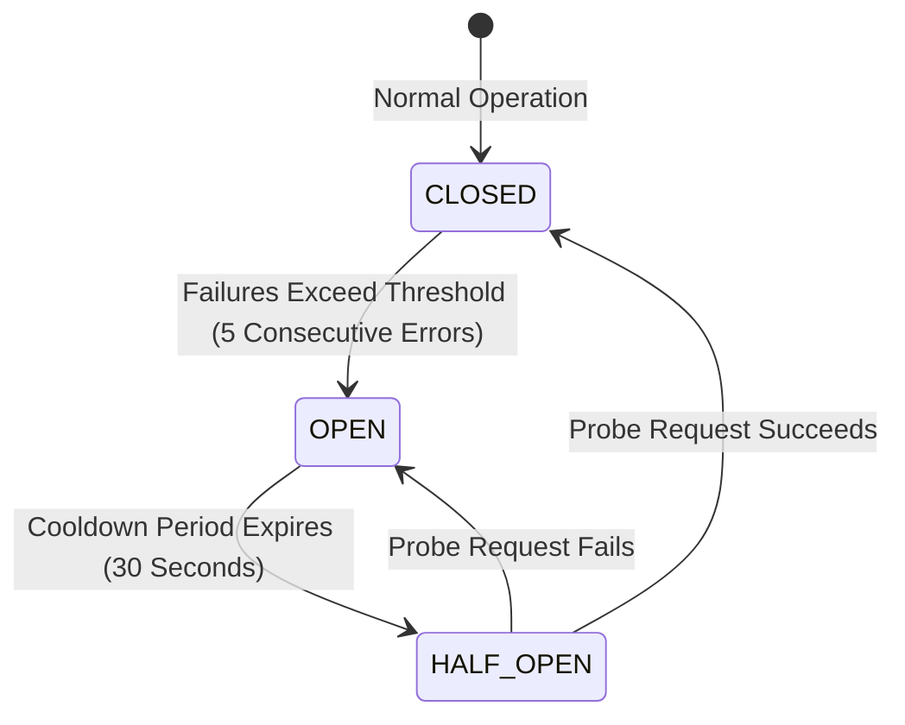

# Comprehensive System Debugging & Diagnostic Procedures

## 1. System Log Inspection Architecture

The KUCET Management System generates structured Pino JSON logs across the application server, proxy container, and autonomous background monitors.

```mermaid
flowchart TD
    LogSource[Application & Infrastructure Events] --> PinoLogger[Pino JSON Logger]
    
    subgraph Log Storage Vault (/var/log/kucet/)
        PinoLogger --> AppLog[deployments.json & stdout]
        PinoLogger --> MonitorLog[monitor.log]
        PinoLogger --> HealthLog[health-check.log]
        PinoLogger --> BackupLog[backup.log]
    end
    
    AppLog --> Logrotate[logrotate Daily Compression]
    Logrotate --> Archive[30-Day Log Archives .gz]
```

### Log File Taxonomy (`/var/log/kucet/`)

| Log Path | Owner / Writer | Information Content |
| :--- | :--- | :--- |
| `/var/log/kucet/deployments.json` | `deploy.sh` | Structured JSON registry of every deployment execution & status. |
| `/var/log/kucet/monitor.log` | `monitor.sh` | Continuous 5-minute health check & self-healing log entries. |
| `/var/log/kucet/health-check.log` | `health-check.sh` | Full 13-point diagnostic suite results. |
| `/var/log/kucet/boot-recovery.log` | `boot-recovery.sh` | Container recovery logs following system reboots. |
| `/var/log/nginx/error.log` | Nginx Proxy | Reverse proxy HTTP errors, buffer overflows, and 502/504 events. |

### Real-Time Container Log Tailing Commands

```bash
# Tail live Next.js application logs
docker logs -f kucet-cms-app

# Tail Nginx proxy logs
docker logs -f kucet-cms-proxy

# Pretty-print structured Pino logs (Requires pino-pretty)
docker logs kucet-cms-app 2>&1 | npx pino-pretty
```

---

## 2. Step-by-Step Error Diagnostic Procedures

When an operational failure or HTTP 500 error is reported, follow this systematic diagnostic workflow:

```mermaid
flowchart TD
    Step1[1. Inspect Error Logs: docker logs kucet-cms-app] --> Step2{Identify Log Pattern}
    
    Step2 -->|DB Error / Timeout| CheckDB[Check DB Container: docker exec -it kucet-cms-db mysqladmin ping]
    Step2 -->|EACCES Permission| CheckPerms[Check File Permissions: ls -ld /var/www/kucet-storage/public]
    Step2 -->|OOM / Process Killed| CheckMemory[Check Swap & Memory: free -h && dmesg | grep -i oom]
    Step2 -->|502 Bad Gateway| CheckNginx[Check Nginx Upstream & Buffer Settings]
```

### System Health Inspection Commands

```bash
# 1. Check Container Health Status
docker compose -f DEPLOYMENT_PACKAGE/docker-compose.yml ps

# 2. Check System Memory & Swap Usage
free -h

# 3. Check NVMe Disk Space Availability
df -h /var/www/kucet-storage/public

# 4. Check OOM Killer Activity in Kernel Log
dmesg -T | grep -i -E 'oom|killed process'

# 5. Execute 13-Point Infrastructure Diagnostic Suite
bash DEPLOYMENT_PACKAGE/SCRIPTS/health-check.sh --json
```

---

## 3. Sentry Tracing & Telemetry

Production error tracking and transaction profiling are integrated via Sentry.

### Sentry Configuration (`.env.production`)

```env
NEXT_PUBLIC_SENTRY_DSN=https://examplePublicKey@o0.ingest.sentry.io/0
SENTRY_TRACES_SAMPLE_RATE=0.2
```

When enabled, Sentry automatically captures unhandled API route exceptions, React client component stack traces, and database query spans.

---

## 4. Circuit Breaker Analysis (`CircuitBreaker.js`)

External service calls (Cloudinary Storage, SMTP Email, Redis Cache) are wrapped inside Circuit Breakers ([`src/lib/utils/CircuitBreaker.js`](file:///D:/User/Desktop/CMS/src/lib/utils/CircuitBreaker.js)) to prevent cascade failures.



### Circuit Breaker States

| State | Behavior | Impact on User |
| :--- | :--- | :--- |
| **`CLOSED`** | Normal execution. All requests pass to the target service. | 100% normal functionality. |
| **`OPEN`** | Target service is failing. Requests fail fast immediately without making network calls. | Operations fall back to local alternatives (e.g., local storage instead of Cloudinary). |
| **`HALF-OPEN`** | Cooldown timer expired. Allows a trial request to probe if target service has recovered. | Transparent probe request. |

### Diagnostic API Endpoint for Circuit Breakers

Administrators can inspect real-time Circuit Breaker states via the Monitoring API:

```http
GET /api/admin/infrastructure/monitoring
Cookie: admin_auth=<JWT_TOKEN>
```

```json
{
  "status": "healthy",
  "circuitBreakers": {
    "CloudinaryStorage": { "state": "CLOSED", "failureCount": 0 },
    "DatabaseConnection": { "state": "CLOSED", "failureCount": 0 },
    "RedisCache": { "state": "CLOSED", "failureCount": 0 }
  }
}
```

---

## Cross-References

* [Active Known Issues & Technical Debt](./known-issues.md)
* [Common Runtime & Build Errors Catalog](./common-errors.md)
* [Self-Hosted VPS Production Setup](../deployment/vps.md)
