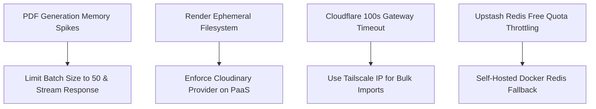

# Active Known Issues, Limitations & Technical Debt Inventory

## 1. Active Known Issues Inventory

This document tracks identified architectural constraints, unresolved system behaviors, and operational limits across the KUCET Management System.

### Known Defect & Constraint Catalog

| Defect / Limitation | Impacted Subsystem | Root Cause | Severity | Current Mitigation |
| :--- | :--- | :--- | :--- | :--- |
| **1. PDF Batch Heap Spikes** | PDF Generator (`puppeteer` / HTML-to-PDF) | High memory consumption when compiling 500+ hall ticket PDFs concurrently. | High | Enforce batch pagination (max 50 cards/batch) and apply 4GB swap space. |
| **2. Ephemeral Storage Loss** | Render Staging (`*.onrender.com`) | Render container disk resets on deploy; uploaded files in `/app/public/uploads` disappear. | Medium | Use `NEXT_PUBLIC_STORAGE_TYPE=cloudinary` on Render PaaS staging. |
| **3. Cloudflare Import Timeout** | Bulk Excel Student Import | Cloudflare drops HTTP connections exceeding 100 seconds on large Excel files (>3,000 rows). | Medium | Import via direct VPS IP or Tailscale WireGuard ingress (`client_max_body_size 0`). |
| **4. Redis Rate Limit Throttling** | Authentication Rate Limiter | Upstash free tier hits daily API call limits during mass student registration surges. | Low | Fall back to self-hosted Redis container (`REDIS_URL=redis://redis:6379`). |

---

## 2. Technical Debt Inventory

1. **Legacy Storage Key Paths in Database**: Historical database records contain paths created prior to the `kucet/` namespace standardization (`requests/pfp/...` instead of `kucet/requests/pfp/...`). Handled dynamically by path normalizers in `getAssetUrl()`.
2. **Audit Log Table Indexing**: The `audit_logs` table lacks Range partitioning by timestamp, causing slow query performance when auditing logs older than 6 months.
3. **Synchronous Email Delivery on Student Approval**: Approving student requests sends transactional Brevo emails synchronously within the API thread rather than delegating to an asynchronous worker queue.

---

## 3. Operational Limits Specification

To ensure operational stability, the system enforces the following quantitative limits:

| System Parameter | Hard Limit | Enforcement Point | Violation Consequence |
| :--- | :--- | :--- | :--- |
| **Image File Size** | 1,048,576 bytes (1MB) | Client Canvas / `LocalStorageProvider` | `HTTP 400`: File too large |
| **Document File Size** | 10,485,760 bytes (10MB) | API Route Validation | `HTTP 400`: Document payload limit exceeded |
| **MySQL Connection Pool** | 150 Active Connections | `kucet.cnf` / Drizzle Pool | `HTTP 500`: `ECONNREFUSED` / Pool Exhausted |
| **PDF Generation Page Limit** | 50 Pages per Request | Hall Ticket / Transcript API | `HTTP 422`: Batch limit exceeded |
| **Login Rate Limit** | 5 Attempts per 15 Minutes | Redis Rate Limiter | `HTTP 429`: Too Many Requests |

---

## Cross-References

* [System Debugging Guide](./debugging-guide.md)
* [Common Runtime & Build Errors Catalog](./common-errors.md)
* [Universal Storage Abstraction Architecture](../storage/file-storage.md)
* [Self-Hosted VPS Production Setup](../deployment/vps.md)
