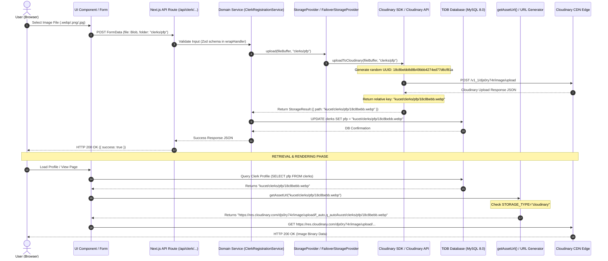

# 🔄 End-to-End Image Pipeline Trace Document

This document traces the 12 distinct stages of an asset's lifecycle in the **KUCET CMS**, from browser user upload through Cloudinary cloud storage and back to browser image delivery.

---

## 🗺️ Complete End-to-End Sequence Diagram



---

## 🔬 Stage-by-Stage Forensic Breakdown

### Stage 1: Browser Selection & Request Dispatch
- **Component**: `<input type="file" accept="image/*">` in React UI.
- **Action**: User selects image binary. Form data is appended with target folder `clerks/pfp` or `students/pfp`.

### Stage 2: Input Validation (`wrapHandler` + Zod)
- **File**: `src/lib/api-utils.js` & `src/lib/cloudinary.js`
- **Validation**: Enforces 1MB file size limit and MIME-type restrictions (`image/jpeg`, `image/png`, `image/webp`).

### Stage 3: Storage Provider Delegation
- **File**: `src/lib/providers/storage/factory.js` & `FailoverStorageProvider.js`
- **Action**: `getStorageProvider()` returns `FailoverStorageProvider` initialized with `[CloudinaryStorageProvider, LocalStorageProvider, S3StorageProvider]`.

### Stage 4: Cryptographic UUID Public ID Generation
- **File**: `src/lib/cloudinary.js` (`uploadToCloudinary`)
- **Security Invariant**: Cryptographic random UUID (`crypto.randomUUID()`) is generated as the filename:
  ```javascript
  const randomFilename = cleanPublicId || crypto.randomUUID().replace(/-/g, '');
  // Output: 18c8bebb8d8b49bbb4274ed77d6cf81a
  ```
- **Rule 2 Guard**: NEVER uses roll numbers, student names, emails, or user IDs as filenames.

### Stage 5: Cloudinary API Execution
- **SDK Method**: `cloudinary.v2.uploader.upload(dataUri, options)`
- **Cloudinary Options**:
  ```json
  {
    "folder": "kucet/clerks/pfp",
    "resource_type": "auto",
    "public_id": "18c8bebb8d8b49bbb4274ed77d6cf81a",
    "unique_filename": false,
    "overwrite": false
  }
  ```

### Stage 6: Raw Cloudinary Upload Response (Empirical Inspection)
- **Inspected Fields**:
  ```json
  {
    "asset_id": "83dacad681ff11e02d40371d8775dd01",
    "public_id": "kucet/clerks/pfp/18c8bebb8d8b49bbb4274ed77d6cf81a",
    "version": 1786690189,
    "version_id": "9b21fd57d9ad27be9cb96fd615e066ea",
    "signature": "1dd6d6784a17e1c8b1ec187b579c641ee382422c",
    "width": 400,
    "height": 400,
    "format": "webp",
    "resource_type": "image",
    "created_at": "2026-08-14T06:49:49Z",
    "bytes": 14200,
    "type": "upload",
    "url": "http://res.cloudinary.com/djs0ry74r/image/upload/v1786690189/kucet/clerks/pfp/18c8bebb8d8b49bbb4274ed77d6cf81a.webp",
    "secure_url": "https://res.cloudinary.com/djs0ry74r/image/upload/v1786690189/kucet/clerks/pfp/18c8bebb8d8b49bbb4274ed77d6cf81a.webp",
    "asset_folder": "kucet/clerks/pfp",
    "display_name": "18c8bebb8d8b49bbb4274ed77d6cf81a"
  }
  ```

### Stage 7: Canonical Relative Key Construction & Database Storage
- **Canonical Format**: `kucet/<folder>/<uuid>.<ext>`
- **Value Stored**: `kucet/clerks/pfp/18c8bebb8d8b49bbb4274ed77d6cf81a.webp`
- **Rule 3 & 4 Verification**: DB stores relative path. NO full URLs, NO `v1786690189/` version prefixes, NO `https://res.cloudinary.com` stored in database.

### Stage 8: Data Read & API Payload
- **Service Query**: `SELECT pfp FROM clerks WHERE id = 6`
- **Result Returned**: `"kucet/clerks/pfp/18c8bebb8d8b49bbb4274ed77d6cf81a.webp"`

### Stage 9: Frontend URL Resolution (`getAssetUrl`)
- **File**: `src/lib/assets.js`
- **Resolution Logic**:
  ```javascript
  if (storageType === 'cloudinary') {
    return `https://res.cloudinary.com/${cloudName}/${resourceType}/upload/${transformations}/${cleanPath}`;
  }
  return `/api/assets/view/${cleanPath}`;
  ```
- **Generated Browser URL**: `https://res.cloudinary.com/djs0ry74r/image/upload/f_auto,q_auto/kucet/clerks/pfp/18c8bebb8d8b49bbb4274ed77d6cf81a.webp`

### Stage 10: Browser Execution & CDN Response
- **HTTP Request**: `GET https://res.cloudinary.com/djs0ry74r/image/upload/f_auto,q_auto/kucet/clerks/pfp/18c8bebb8d8b49bbb4274ed77d6cf81a.webp`
- **Response**: **HTTP 200 OK** (Content-Type: `image/webp`)
- **UI Result**: Profile picture renders crisply inside header, dashboard, and management tables!
