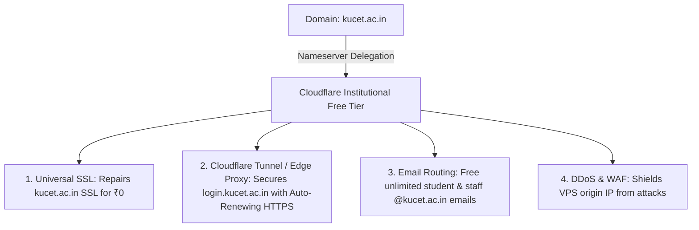

# KUCET College Management System (CMS)
## Official Yearly Budget Plan, VPS Comparison & Cloudflare Migration Strategy (Initial Version)

**Prepared For:** KUCET College Administration, HODs, & Technical Architect  
**Prepared By:** Technical Architecture & Lead System Administrator  
**Date:** July 26, 2026  
**Reference Files:**
- [MASTER_DEPLOYMENT_GUIDE.md](file:///D:/User/Desktop/CMS/DEPLOYMENT_PACKAGE/MASTER_DEPLOYMENT_GUIDE.md)
- [sitecontext.md](file:///D:/User/Desktop/CMS/sitecontext.md)
- [GEMINI.md](file:///D:/User/Desktop/CMS/GEMINI.md)
- [IMAGE_STORAGE_STRATEGY.md](file:///D:/User/Desktop/CMS/DEPLOYMENT_PACKAGE/IMAGE_STORAGE_STRATEGY.md)

---

## Executive Summary

This document provides a comprehensive institutional proposal for:
1. **Migrating Domain DNS Control** from GoDaddy to **Cloudflare’s Institutional Free Tier** to fix the expired SSL certificate on the main website (`kucet.ac.in`), secure the new application subdomain (`login.kucet.ac.in`), and provision unlimited official student/faculty email routing (`student@kucet.ac.in`) at **₹0 cost**.
2. **VPS Hosting Infrastructure Acquisition** for hosting the Node.js/Next.js App, MySQL 8.0 Database, Redis 7 Cache, Nginx Reverse Proxy, and Uptime Kuma monitoring stack.
3. **Emergency Backup Resilience** for daily automated database SQL dumps and image vault cloud sync.
4. **5 Permutation & Combination Budget Plans** with exact financial calculations including **18% Indian GST**.

---

## Section 1: Current Website & DNS Context

As documented in `sitecontext.md`, the current web infrastructure faces key challenges:

```
Current Problem Context:
┌───────────────────────────────────┐    ┌───────────────────────────────────┐
│     kucet.ac.in (Main Domain)     │    │      cPanel Local Zone Editor     │
├───────────────────────────────────┤    ├───────────────────────────────────┤
│ • SSL Certificate Expired          │    │ • NS records point to 10.x.x.x    │
│ • Insecure Browser Warnings       │    │ • Restricted/Broken DNS Editor    │
│ • Unencrypted HTTP Fallback       │    │ • Not live/authoritative          │
└───────────────────────────────────┘    └───────────────────────────────────┘
                                   ▲
                                   │ Authoritative Nameservers
                                   │ ns56.domaincontrol.com (GoDaddy)
                                   │
                         GoDaddy DNS Management
```

### Key Technical Discoveries:
1. **GoDaddy is Authoritative:** The nameservers for `kucet.ac.in` point to `ns56.domaincontrol.com` (GoDaddy). Editing DNS records inside cPanel does NOT update public internet routing.
2. **Expired Main Domain SSL:** The main website lacks auto-renewal, creating security warnings for visitors.
3. **Subdomain Security Requirement:** The new CMS application requires a secure, HTTPS-enabled subdomain (`login.kucet.ac.in`).

---

## Section 2: Benefits of Migrating DNS to Cloudflare (Free Tier)

Changing the authoritative nameservers in GoDaddy to Cloudflare's free nameservers costs **₹0.00** and provides major institutional advantages:



### Detailed Benefit Breakdown:

1. **Complete & Free SSL Warning Repair (`kucet.ac.in`):**
   - Cloudflare issues an automatic **Universal SSL Certificate** (256-bit ECC encryption).
   - Eliminates browser warning screens on the main college website completely free of cost (saving ~₹2,950/yr in commercial SSL certificates).

2. **Auto-Renewing HTTPS for CMS Subdomain (`login.kucet.ac.in`):**
   - Edge proxy automatically issues and renews HTTPS certificates for the CMS portal.
   - When paired with **Cloudflare Tunnels (`cloudflared`)**, the server's origin IP address remains hidden, rendering the server immune to direct IP attacks.

3. **Unlimited Official College Emails (`student@kucet.ac.in`) at ₹0 Cost:**
   - **Commercial Cost:** Google Workspace or Microsoft 365 costs ₹150–₹400 per user per month. For 1,000 students and staff, this costs **₹1.8 Lakhs to ₹4.8 Lakhs per year**.
   - **Cloudflare Solution:** **Cloudflare Email Routing** allows creating unlimited custom email aliases (e.g., `218w1a0501@kucet.ac.in`, `hod.cse@kucet.ac.in`) and automatically forwarding incoming messages to personal Gmail or Outlook accounts. Outgoing verification emails are routed via free transactional email providers (SendGrid/Resend).

4. **Web Application Firewall (WAF) & Speed Optimization:**
   - Enterprise L3/L4/L7 DDoS protection blocks malicious bots before they reach the VPS.
   - Global CDN caching with Indian edge nodes (Hyderabad, Mumbai, Chennai) reduces website load times.

---

## Section 3: Emergency Backup Resilience Architecture

To safeguard all academic records, grades, financial transactions, and student documents:

```
Server Storage (/var/www/kucet-cms)
  ├── 1. MySQL 8.0 Container ---> Daily 2:00 AM Cron ---> /var/kucet-db-backup/db_backup_YYYYMMDD.sql.gz
  └── 2. Asset Vault Storage ---> Daily 4:00 AM Rclone ---> Free Google Drive / Cloudflare R2 Cloud Vault
```

### A. Database (SQL) Automated Backups
- **Execution:** Automated daily `mysqldump` executed inside the Docker container via `nightly-backup.sh` at 2:00 AM.
- **Storage:** Gzipped archive stored locally in `/var/kucet-db-backup` with strict `700` system permissions.

### B. Asset Vault (Photos, Signatures, Certificates) Offsite Sync
- **Execution:** Automated daily sync via **Rclone** at 4:00 AM (`offsite-backup.sh`).
- **Tier 1 (Free):** Syncs directly to a free institutional Google Drive account (15GB included, costs **₹0.00**).
- **Tier 2 (Paid Cloud Storage - Optional):** Syncs to Cloudflare R2 / AWS S3 (100GB Bucket Storage) with zero egress bandwidth charges.

---

## Section 4: VPS Hosting Provider Evaluation

Hardware requirements for hosting the Next.js App, MySQL 8.0, Redis 7, Nginx, and Uptime Kuma stack:
- **vCPU:** Minimum 2 Cores (4 Cores recommended for faster builds)
- **RAM:** Minimum 4 GB (8 GB recommended)
- **Storage:** Minimum 50 GB NVMe SSD
- **Swap:** 4 GB safety swap space configured

### Provider Comparison Matrix:

| Specification / Feature | **Hostinger KVM 2** *(Primary Candidate)* | **Contabo Cloud VPS 10** *(Budget Alternative)* | **Hetzner Cloud CX32** *(EU High-Performance)* | **Self-Hosted On-Prem Server** *(Local PC Option)* |
| :--- | :--- | :--- | :--- | :--- |
| **vCPU Cores** | 2 Cores | 4 Cores | 4 Cores | 4–8 Cores (Existing Server PC) |
| **RAM** | 8 GB | 8 GB | 8 GB | 16–32 GB |
| **NVMe SSD Storage** | 100 GB | 75 GB | 80 GB | 512 GB SSD |
| **Data Center Location** | **India (Mumbai)** | **India (Navi Mumbai)** | Germany / Finland | On-Premise (KUCET Campus) |
| **Monthly Base Cost** | ₹779.00 / mo | €6.50 / mo (~₹715.00) | €6.80 / mo (~₹747.00) | ₹0.00 |
| **Annual Base Subtotal** | ₹9,348.00 | ₹8,580.00 | ₹8,964.00 | ₹0.00 |
| **GST @ 18% / Forex** | ₹1,682.64 | ₹1,544.40 | ₹1,613.52 | ₹0.00 |
| **Year 1 Total Cost** | **₹11,030.64** | **₹10,124.40** | **₹10,577.52** | **₹0.00** |
| **Year 2 Renewal Rate** | ₹16,977.84 / yr *(standard rate)* | ~₹10,124.40 / yr *(fixed rate)* | ~₹10,577.52 / yr *(fixed rate)* | ₹0.00 |

---

## Section 5: Permutations & Combinations Budget Plans

We have compiled **5 Distinct Budget Permutations** depending on management authorization regarding Cloudflare DNS migration, hosting platform selection, and backup storage tiers.

---

### PLAN 1: Premier Institutional Plan (RECOMMENDED)
> **Combination:** Hostinger KVM 2 VPS + Cloudflare Institutional Free Tier + Free Rclone Backup

*Provides optimal performance, Mumbai low-latency hosting, native Indian GST invoicing, complete SSL security, and zero email hosting expenses.*

| Item Description | Quantity / Term | Unit Price | Base Subtotal | GST (18%) | Total Year 1 Cost |
| :--- | :---: | :---: | :---: | :---: | :---: |
| **Hostinger KVM 2 VPS** (2 vCPU, 8GB RAM, 100GB NVMe, India DC) | 12 Months | ₹779.00 / mo | ₹9,348.00 | ₹1,682.64 | **₹11,030.64** |
| **Cloudflare Universal SSL** (`kucet.ac.in` Main Site Fix) | 1 Year | ₹0.00 | ₹0.00 | ₹0.00 | **₹0.00** |
| **Cloudflare Subdomain SSL & Edge Security** (`login.kucet.ac.in`) | 1 Year | ₹0.00 | ₹0.00 | ₹0.00 | **₹0.00** |
| **Cloudflare Email Routing** (Unlimited `@kucet.ac.in` Emails) | Unlimited | ₹0.00 | ₹0.00 | ₹0.00 | **₹0.00** |
| **Automated Emergency Offsite Backup** (Rclone + Google Drive 15GB) | Daily | ₹0.00 | ₹0.00 | ₹0.00 | **₹0.00** |
| **GRAND TOTAL (YEAR 1 INCLUDING GST)** | | | | | **₹11,030.64** |

---

### PLAN 2: Budget High-Core VPS Plan
> **Combination:** Contabo Cloud VPS 10 + Cloudflare Institutional Free Tier + Free Rclone Backup

*Offers 4 CPU cores and predictable annual renewal costs.*

| Item Description | Quantity / Term | Unit Price | Base Subtotal | GST / Forex (18%) | Total Year 1 Cost |
| :--- | :---: | :---: | :---: | :---: | :---: |
| **Contabo Cloud VPS 10** (4 vCPU, 8GB RAM, 75GB NVMe, India DC) | 12 Months | ~₹715.00 / mo | ₹8,580.00 | ₹1,544.40 | **₹10,124.40** |
| **Cloudflare Universal SSL & Security Suite** | 1 Year | ₹0.00 | ₹0.00 | ₹0.00 | **₹0.00** |
| **Cloudflare Email Routing** (`student@kucet.ac.in`) | Unlimited | ₹0.00 | ₹0.00 | ₹0.00 | **₹0.00** |
| **Automated Emergency Offsite Backup** (Rclone + Google Drive) | Daily | ₹0.00 | ₹0.00 | ₹0.00 | **₹0.00** |
| **GRAND TOTAL (YEAR 1 INCLUDING GST)** | | | | | **₹10,124.40** |

---

### PLAN 3: Zero-Hosting Sovereign Plan (On-Premise Server)
> **Combination:** Existing Campus Server Hardware + Cloudflare Tunnel + Free Rclone Backup

*Utilizes existing campus hardware as documented in [MASTER_DEPLOYMENT_GUIDE.md](file:///D:/User/Desktop/CMS/DEPLOYMENT_PACKAGE/MASTER_DEPLOYMENT_GUIDE.md). Securely exposed via Cloudflare Tunnel (`cloudflared`) without requiring a public IP.*

| Item Description | Quantity / Term | Unit Price | Base Subtotal | GST (18%) | Total Year 1 Cost |
| :--- | :---: | :---: | :---: | :---: | :---: |
| **On-Premise College Server PC** (Existing hardware + UPS) | 1 Year | ₹0.00 | ₹0.00 | ₹0.00 | **₹0.00** |
| **Cloudflare Tunnel (`cloudflared`) & Edge SSL** | 1 Year | ₹0.00 | ₹0.00 | ₹0.00 | **₹0.00** |
| **Cloudflare Email Routing** | Unlimited | ₹0.00 | ₹0.00 | ₹0.00 | **₹0.00** |
| **Automated Emergency Offsite Backup** (Rclone + Google Drive) | Daily | ₹0.00 | ₹0.00 | ₹0.00 | **₹0.00** |
| **GRAND TOTAL (YEAR 1 INCLUDING GST)** | | | | | **₹0.00** |

---

### PLAN 4: Legacy Restricted Plan (No Cloudflare Migration)
> **Combination:** Hostinger KVM 2 VPS + Legacy GoDaddy DNS + Commercial SSL Certificates

*If GoDaddy nameservers cannot be modified, commercial SSL certificates and email hosting extensions must be purchased.*

| Item Description | Quantity / Term | Unit Price | Base Subtotal | GST (18%) | Total Year 1 Cost |
| :--- | :---: | :---: | :---: | :---: | :---: |
| **Hostinger KVM 2 VPS** (2 vCPU, 8GB RAM, 100GB NVMe) | 12 Months | ₹779.00 / mo | ₹9,348.00 | ₹1,682.64 | **₹11,030.64** |
| **Commercial SSL Certificate** (`kucet.ac.in` Main Site) | 1 Year | ₹2,499.00 | ₹2,499.00 | ₹449.82 | **₹2,948.82** |
| **Wildcard/Subdomain SSL Certificate** (`login.kucet.ac.in`) | 1 Year | ₹4,999.00 | ₹4,999.00 | ₹899.82 | **₹5,898.82** |
| **Basic cPanel Email Extension Fee** (Limited mailboxes) | 1 Year | ₹5,000.00 | ₹5,000.00 | ₹900.00 | **₹5,900.00** |
| **Automated Emergency Offsite Backup** (Rclone + Google Drive) | Daily | ₹0.00 | ₹0.00 | ₹0.00 | **₹0.00** |
| **GRAND TOTAL (YEAR 1 INCLUDING GST)** | | | | | **₹25,778.28** |

*Note: Keeping DNS on GoDaddy increases annual costs by **₹14,747.64** solely for SSL certificates and mail hosting fees.*

---

### PLAN 5: Enterprise Multi-Cloud Resilience Plan
> **Combination:** Hostinger KVM 2 VPS + Cloudflare Free Tier + Dedicated Cloudflare R2 Storage Vault

*Includes 100GB of dedicated cloud object storage bucket for archival storage of all student documents, PDFs, signatures, and encrypted database dumps.*

| Item Description | Quantity / Term | Unit Price | Base Subtotal | GST (18%) | Total Year 1 Cost |
| :--- | :---: | :---: | :---: | :---: | :---: |
| **Hostinger KVM 2 VPS** (2 vCPU, 8GB RAM, 100GB NVMe) | 12 Months | ₹779.00 / mo | ₹9,348.00 | ₹1,682.64 | **₹11,030.64** |
| **Cloudflare Universal SSL & Security Edge** | 1 Year | ₹0.00 | ₹0.00 | ₹0.00 | **₹0.00** |
| **Cloudflare Email Routing** (`student@kucet.ac.in`) | Unlimited | ₹0.00 | ₹0.00 | ₹0.00 | **₹0.00** |
| **Cloudflare R2 Storage Vault** (100GB S3 Storage Bucket) | 12 Months | ~$1.50 / mo (~₹125) | ₹1,500.00 | ₹270.00 | **₹1,770.00** |
| **GRAND TOTAL (YEAR 1 INCLUDING GST)** | | | | | **₹12,800.64** |

---

## Section 6: Final Financial Summary & Recommendation

### Permutation Master Comparison Table

| Plan # | Plan Name | Cloudflare DNS Migrated? | Base Cost (Excl. GST) | GST Amount (18%) | **Total Year 1 Cost (Incl. GST)** |
| :---: | :--- | :---: | :---: | :---: | :---: |
| **PLAN 1** | **Hostinger KVM 2 + Cloudflare Free Tier + Free Backup** *(Recommended)* | **YES** | **₹9,348.00** | **₹1,682.64** | **₹11,030.64** |
| **PLAN 2** | **Contabo VPS 10 + Cloudflare Free Tier + Free Backup** | **YES** | **₹8,580.00** | **₹1,544.40** | **₹10,124.40** |
| **PLAN 3** | **On-Premise Campus Server + Cloudflare Tunnel** | **YES** | **₹0.00** | **₹0.00** | **₹0.00** |
| **PLAN 4** | **Hostinger KVM 2 + GoDaddy DNS (No Cloudflare)** | **NO** | **₹21,846.00** | **₹3,932.28** | **₹25,778.28** |
| **PLAN 5** | **Hostinger KVM 2 + Cloudflare Free Tier + Cloudflare R2 Storage** | **YES** | **₹10,848.00** | **₹1,952.64** | **₹12,800.64** |

---

### Key Takeaways & Recommendations:

1. **Migrate DNS to Cloudflare (Crucial Step):**
   - Updating nameservers in GoDaddy to Cloudflare's free institutional tier saves **₹14,747.64 per year** by removing commercial SSL costs and email hosting fees.
2. **Adopt Plan 1 (₹11,030.64 Incl. GST):**
   - Primary recommendation for college deployment: Hostinger KVM 2 (2 vCPU / 8GB RAM / 100GB NVMe SSD in Mumbai) provides high stability, native Indian GST invoicing, and low latency across Telangana and AP.
3. **Automated Emergency Backups:**
   - Execute `nightly-backup.sh` (MySQL dumps) and `offsite-backup.sh` (Rclone Google Drive sync) as detailed in [MASTER_DEPLOYMENT_GUIDE.md](file:///D:/User/Desktop/CMS/DEPLOYMENT_PACKAGE/MASTER_DEPLOYMENT_GUIDE.md) to maintain zero-cost offsite resilience.
