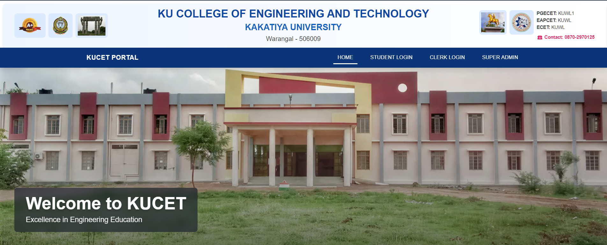
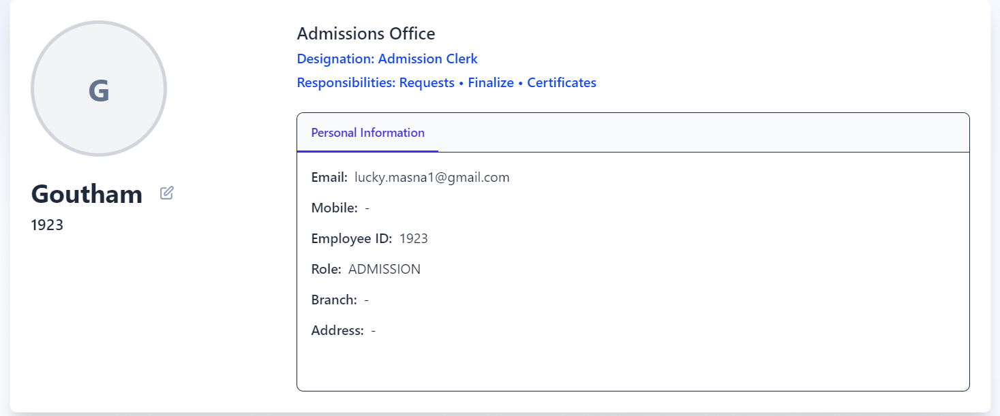
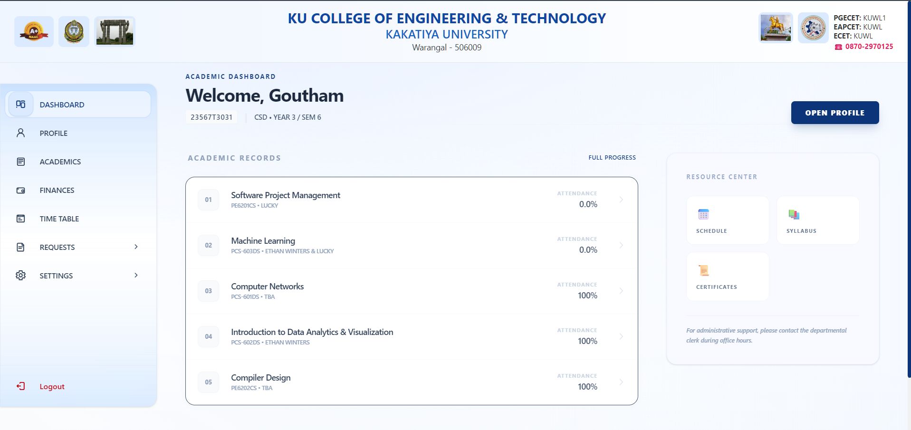
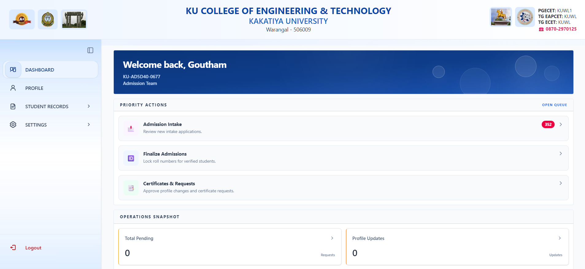
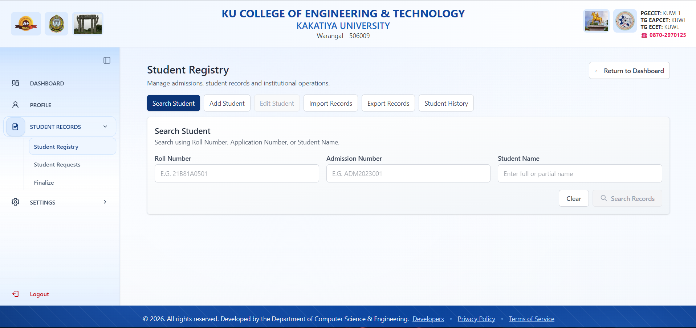
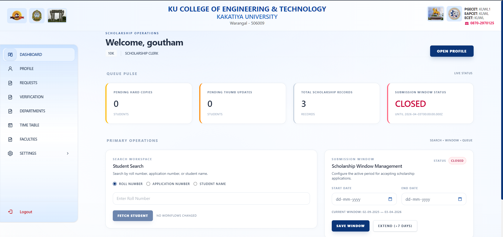

# KUCET College Management System

A production-oriented, role-based college management platform built for **Kakatiya University College of Engineering and Technology (KUCET)**.

The system is designed to replace fragmented manual workflows with a centralized digital ecosystem that handles admissions, academics, attendance, scholarships, certificates, departmental management, and institutional administration.

📖 **Complete Documentation:** Refer to the [DOCUMENTATION/](./DOCUMENTATION/README.md) directory for architectural guidelines, system invariants, database schema details, and development manuals.

🤖 **AI Guidelines & Architecture Knowledge Base:** Refer to [GEMINI.md](./GEMINI.md) for the AI-agent instruction index and system architecture breakdown.
# 🎯 Vision

To build a scalable institutional platform where:

* Students manage academics, attendance, finances, and requests digitally
* Faculty and HODs manage departmental operations in real time
* Clerks handle admissions, scholarships, and verification workflows efficiently
* Administration gains centralized governance, auditing, and infrastructure control

This is being developed as a real-world institutional system — not a demo CRUD project.

# ✨ Major Features

## 🔐 Institutional Authentication \& Security

* JWT authentication with secure HTTP-only cookies
* Silent token refresh & session rotation
* Centralized multi-role session isolation & explicit HTTP 1970 cookie purging
* AES-256-GCM encryption for sensitive student data
* Blind indexing for Aadhaar \& mobile numbers
* Role-based access control
* Audit logging system
* Rate limiting \& brute-force protection

## 🎓 Student Portal

* Personalized dashboard
* Academic progress tracking
* Real-time attendance visibility
* Fee \& scholarship overview
* Digital certificate requests
* Student profile management
* Profile update request workflow with verification proof uploads
* Live session activity bar
* Mobile-first responsive UI

## 🧑‍🏫 Faculty \& HOD System

* Attendance session management
* GPS + PIN based attendance verification
* Internal marks entry system
* Faculty workload analytics
* Department timetable management
* Branch syllabus orchestration
* Faculty substitution management
* Live classroom session broadcasting
* Branch-level governance controls

## 🧑‍💼 Administrative Clerk System

* Student admission finalization
* Automated roll number generation
* Student registry management
* Certificate approval workflows
* Student modification request verification
* Migration Excel export system
* Institutional request management center

## 💰 Scholarship Management System

* Government scholarship workflow automation
* Year-wise scholarship tracking
* Dynamic RTF calculations
* Payment registration \& proceeding management
* Scholarship summary analytics
* Minority \& category-based reimbursement logic
* Payment limit enforcement
* Application number propagation system

## 📚 Academic Infrastructure

* Dynamic academic calendar
* Semester intelligence engine
* Attendance orchestration
* Student detention \& offset management
* Branch subject mapping
* Marks pattern governance
* Real-time departmental sync

## 📄 Digital Certificate Engine

Supports:

* Bonafide Certificates
* Transfer Certificates
* No Objection Certificates
* Course Completion Certificates
* Study \& Conduct Certificates
* Migration Certificates
* Income Tax Certificates

Features:

* Professional PDF rendering
* QR verification support
* Digital signatures
* Verification tracking
* Download history
* Institutional branding

# ⚡ Advanced Platform Features

## 🚀 Real-Time Infrastructure

* Supabase Realtime integration
* Distributed SSE architecture
* Live notification broadcasting
* Instant attendance/session sync
* Zombie connection recovery heartbeat system

## 📱 Progressive Web App (PWA)

* Offline-ready architecture
* Mobile-first experience
* Optimized Android experience
* Background synchronization support
* Installable web application

## 🧠 Smart Institutional Automation

* Roll number intelligence engine
* Academic year \& semester auto-resolution
* Attendance eligibility automation
* Scholarship fee calculations
* Dynamic admission batch handling
* Auto-generated academic timelines

## 🛡️ Reliability \& Production Engineering

* Drizzle ORM + versioned migrations
* TiDB Cloud infrastructure
* Automated database backups
* Cloudinary asset infrastructure
* CI/CD quality gates
* ESLint + Husky enforcement
* Playwright E2E testing
* k6 load testing
* Structured logging \& monitoring
* Environment validation with Zod

# 🖥️ Tech Stack

## Frontend

* Next.js 16 (App Router)
* React 19
* Tailwind CSS 4

## Backend

* Next.js API Routes
* Node.js

## Database \& ORM

* TiDB Cloud (MySQL-compatible)
* Drizzle ORM

## Authentication

* Secure stateless JWTs (`jose`)
* Edge Middleware Token Validation
* Distributed Session Revocation using `user_sessions`

## Realtime \& Infrastructure

* Supabase Realtime
* Upstash Redis
* Cloudinary
* PWA support

## Validation \& Utilities

* Zod
* bcrypt
* react-hot-toast
* xlsx-js-style
* qrcode

# 🏗️ Architecture Highlights

* Service Layer architecture
* Thin API routes
* Context-driven state management
* Optimistic UI workflows
* Distributed realtime broadcasting
* Modular institutional components
* Versioned database migrations
* Role-aware middleware protection

# 📸 Screenshots
- ## Home Page:
    
- ## Profile Module:
    
- ## Student Dashboard:
    
- ## Administrative Clerk Dashboard:
    
    
- ## Scholarship Clerk Dashboard:
    

# 🚀 Future Scopex

* Hostel \& transport modules
* University-level synchronization
* Native mobile app ecosystem (React Native)
* Smart classroom integrations
* Predictive academic risk analytics

# 📌 Current Status

🟢 **Actively Developed & Production-Oriented**

The platform is continuously evolving with:

* Institutional-grade workflows
* Scalability-focused architecture
* Security-first engineering (Recent upgrade: Comprehensive session restoration and manual-login exclusivity)
* Real-time operational systems
* Long-term maintainability in mind

# 👨‍💻 Development Philosophy

This project prioritizes:

* Correctness over shortcuts
* Scalability over temporary fixes
* Security over convenience
* Institutional reliability over flashy UI

The goal is to build a system capable of serving thousands of students and staff in a real academic environment.