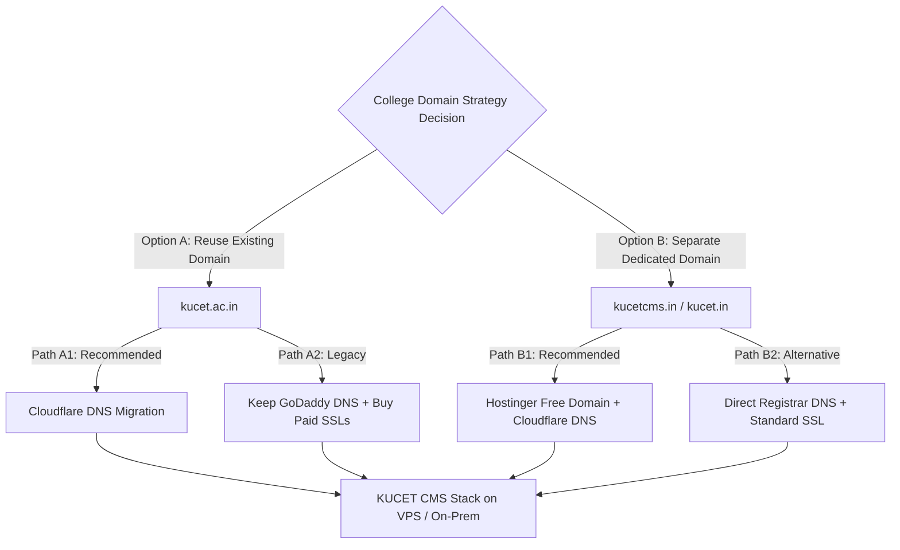

# KUCET College Management System (CMS)
## Master Institutional Yearly Budget Plan, Domain Migration Options & Deployment Readiness Guide

**Prepared For:** KUCET College Administration, HODs, & Technical Architect  
**Prepared By:** Lead System Architect & Infrastructure Engineering Team  
**Date:** July 27, 2026 (Revision 2.0 - Verified Pricing & Separate Domain Expansion)  
**Reference Screenshot:** [WhatsApp Cart Screenshot (Hostinger KVM 2)](file:///D:/User/Downloads/WhatsApp%20Image%202026-07-03%20at%205.59.03%20PM.jpeg)  
**Reference Documentation:**
- [MASTER_DEPLOYMENT_GUIDE.md](file:///D:/User/Desktop/CMS/DEPLOYMENT_PACKAGE/MASTER_DEPLOYMENT_GUIDE.md)
- [sitecontext.md](file:///D:/User/Desktop/CMS/sitecontext.md)
- [GEMINI.md](file:///D:/User/Desktop/CMS/GEMINI.md)
- [IMAGE_STORAGE_STRATEGY.md](file:///D:/User/Desktop/CMS/DEPLOYMENT_PACKAGE/IMAGE_STORAGE_STRATEGY.md)

---

> [!IMPORTANT]
> **VERIFIED CART PRICE NOTICE (HOSTINGER KVM 2):**  
> Based on the official Hostinger checkout cart screenshot (`WhatsApp Image 2026-07-03 at 5.59.03 PM.jpeg`), the exact 12-month Hostinger KVM 2 cost is **₹929/month base rate**, yielding a base total of ₹11,148.00 + 18% GST (₹2,006.64). **Total Cart Checkout Price: ₹13,154.64**.  
> The plan includes **1 FREE Domain for 1 Year** (e.g., `.in` or `.com`). Renewal for Year 2 is ₹1,399/mo + 18% GST (**₹19,809.84 / Year**).

---

## Executive Overview

This master planning document provides a complete institutional roadmap for deploying the KUCET College Management System. It addresses two primary domain deployment pathways:

1. **Option A (Existing Domain `kucet.ac.in`):** Migrating DNS control from GoDaddy to **Cloudflare Institutional Free Tier** to fix the main site SSL warning and run CMS on `login.kucet.ac.in`.
2. **Option B (Separate Independent Domain e.g., `kucetlogin.in` / `kucet-edu.in`):** Purchasing/using a dedicated domain for the CMS app (utilizing the **Free 1-Year Domain** bundled with Hostinger VPS or registering a `.in` domain), giving 100% administrative sovereignty without altering the existing college website setup.

It also contains exact **Hostinger verified pricing**, alternative VPS evaluations, emergency offsite backup plans, and a **Comprehensive Pre-Migration Preparedness Checklist**.

---

## Section 1: Domain Architecture Scenarios



### Option A: Reusing Existing Domain (`kucet.ac.in`)
- **Subdomain Structure:** CMS operates on `login.kucet.ac.in`.
- **Path A1 (Cloudflare DNS Migration - Recommended):** Change Nameservers in GoDaddy to Cloudflare. Instant free SSL repair for main site (`kucet.ac.in`), auto-renewing HTTPS for CMS subdomain, and free `@kucet.ac.in` student email routing.
- **Path A2 (GoDaddy DNS Retained):** Keep GoDaddy nameservers. Requires purchasing commercial SSL certificates for both main domain and subdomain (~₹8,847/yr extra).

### Option B: Purchasing / Using a Separate Independent Domain (`kucetlogin.in` / `kucet-edu.in`)
- **Domain Structure:** CMS operates on `kucetlogin.in` or `login.kucet.in`.
- **Path B1 (Free Bundled Hostinger Domain + Cloudflare - Recommended):** 
  - Hostinger KVM 2 includes **1 FREE Domain for 1 Year** (e.g. `kucetlogin.in` or `kucet-portal.in`).
  - **100% Administrative Sovereignty:** The technical team has full ownership of DNS from minute one—no waiting for GoDaddy credentials or institutional approval delays from existing webmasters.
  - Set Cloudflare nameservers directly at domain creation for instant free SSL, WAF, and `@kucetlogin.in` email forwarding.
- **Path B2 (Dedicated `.ac.in` Domain via ERNET):** Register `kucetlogin.ac.in` via ERNET India (~₹1,000/yr).

---

## Section 2: Benefits of Cloudflare DNS Migration

Whether using the existing domain (`kucet.ac.in`) or a new domain (`kucetlogin.in`), routing DNS through Cloudflare's Institutional Free Tier provides major advantages:

1. **₹0 Universal SSL Certificates:**
   - Automatically issues and renews 256-bit ECC SSL certificates for main domains and subdomains.
   - Eliminates browser "Insecure Site" warning screens completely free of charge.

2. **Zero-Trust Tunnels (`cloudflared`):**
   - Connects the VPS or On-Premise server directly to Cloudflare's edge network without opening vulnerable public ports (Port 80/443) on the firewall.
   - Origin IP address remains completely hidden from hackers, protecting against direct port scans and brute-force SSH attacks.

3. **Unlimited Institutional Email Routing (`student@kucet.ac.in` / `student@kucetlogin.in`):**
   - **Cost Comparison:** Commercial Google Workspace / Microsoft 365 costs ₹150–₹400/user/mo (₹1.8 Lakhs – ₹4.8 Lakhs/year for 1,000 students).
   - **Cloudflare Solution:** Create unlimited official email addresses and automatically forward incoming mail to students' and faculty members' personal Gmail/Outlook accounts at **₹0 cost**.

4. **DDoS Protection & Web Application Firewall (WAF):**
   - Unmetered Layer 3/4/7 DDoS mitigation protects server resources during peak exam/admission registration periods.
   - Global CDN caching with Indian edge nodes (Hyderabad, Mumbai, Chennai) speeds up page delivery.

---

## Section 3: Emergency Backup Resilience Architecture

To protect student records, internal marks, and payment proofs against hardware failure:

```
VPS / Server Data Storage
  ├── Database Container (MySQL 8.0) ──> Daily 2:00 AM Cron ──> Gzipped SQL Backup (/var/kucet-db-backup)
  └── Asset Vault Storage (/public) ──> Daily 4:00 AM Rclone ──> Cloud Offsite Vault (Google Drive / R2)
```

1. **Automated Database Dumps (SQL):**
   - Executed via `nightly-backup.sh` at 2:00 AM daily.
   - Creates a compressed MySQL dump (`db_backup_YYYYMMDD.sql.gz`) with strict `700` local file permissions.

2. **Automated File Vault Offsite Sync (Rclone):**
   - Executed via `offsite-backup.sh` at 4:00 AM daily.
   - **Tier 1 (Free):** Syncs student photos, signatures, and payment screenshots to a 15GB free Google Drive account (**₹0.00/yr**).
   - **Tier 2 (Paid Cloud Object Storage - Optional):** Syncs to Cloudflare R2 / AWS S3 (100GB Bucket Storage) with zero egress bandwidth fees.

---

## Section 4: Verified VPS Hosting Provider Comparison

Hardware specifications required to run Node.js (Next.js 16) + MySQL 8.0 + Redis 7 + Nginx + Uptime Kuma:
- **vCPU:** Minimum 2 Cores (4 Cores recommended for builds)
- **RAM:** Minimum 4 GB (8 GB recommended)
- **Storage:** Minimum 50 GB NVMe SSD
- **Swap:** 4 GB safety swap configured

### Provider Evaluation Table (Verified Cart Pricing)

| Feature / Metric | **Hostinger KVM 2** *(Verified Cart)* | **Contabo Cloud VPS 10** *(Budget Alternative)* | **Hetzner Cloud CX32** *(EU High Performance)* | **Self-Hosted On-Prem Server** *(Local PC Option)* |
| :--- | :--- | :--- | :--- | :--- |
| **vCPU Cores** | 2 Cores | 4 Cores | 4 Cores | 4–8 Cores (Existing Desktop/Server) |
| **RAM** | 8 GB | 8 GB | 8 GB | 16–32 GB |
| **NVMe SSD Storage** | 100 GB | 75 GB | 80 GB | 512 GB SSD |
| **Data Center Location** | **India (Mumbai)** | **India (Navi Mumbai)** | Germany / Finland | On-Premise (KUCET Campus) |
| **Bundled Perks** | **1 FREE Domain (1 Year)** | None | None | None |
| **Monthly Base Price** | ₹929.00 / mo | €6.50 / mo (~₹715.00) | €6.80 / mo (~₹747.00) | ₹0.00 |
| **Annual Base Subtotal** | ₹11,148.00 | ₹8,580.00 | ₹8,964.00 | ₹0.00 |
| **GST @ 18% / Forex** | ₹2,006.64 | ₹1,544.40 | ₹1,613.52 | ₹0.00 |
| **Year 1 Total Cost** | **₹13,154.64** | **₹10,124.40** | **₹10,577.52** | **₹0.00** |
| **Year 2 Renewal Rate** | **₹19,809.84 / yr** *(₹1,399/mo + GST)* | **~₹10,124.40 / yr** *(Fixed rate)* | **~₹10,577.52 / yr** *(Fixed rate)* | **₹0.00** |

---

## Section 5: Expanded Permutations & Combinations Budget Plans

Below are **6 Permutation Plans** combining domain choices (Existing vs New), DNS strategies (Cloudflare vs GoDaddy), and VPS hosting providers.

---

### PLAN 1A: Premier Existing Domain Plan (RECOMMENDED)
> **Combination:** Existing Domain (`kucet.ac.in`) + Hostinger KVM 2 + Cloudflare Free Tier + Free Backup

*Operates on `login.kucet.ac.in`. Repairs main site SSL for free, provides 8GB RAM Mumbai VPS, and zero email hosting cost.*

| Item Description | Quantity / Term | Unit Price | Base Subtotal | GST (18%) | Total Year 1 Cost |
| :--- | :---: | :---: | :---: | :---: | :---: |
| **Hostinger KVM 2 VPS** (2 vCPU, 8GB RAM, 100GB NVMe, India DC) | 12 Months | ₹929.00 / mo | ₹11,148.00 | ₹2,006.64 | **₹13,154.64** |
| **Cloudflare Universal SSL** (`kucet.ac.in` Main Site Fix) | 1 Year | ₹0.00 | ₹0.00 | ₹0.00 | **₹0.00** |
| **Cloudflare Subdomain SSL & Edge Security** (`login.kucet.ac.in`) | 1 Year | ₹0.00 | ₹0.00 | ₹0.00 | **₹0.00** |
| **Cloudflare Email Routing** (Unlimited `@kucet.ac.in` Emails) | Unlimited | ₹0.00 | ₹0.00 | ₹0.00 | **₹0.00** |
| **Automated Emergency Offsite Backup** (Rclone + Google Drive 15GB) | Daily | ₹0.00 | ₹0.00 | ₹0.00 | **₹0.00** |
| **GRAND TOTAL (YEAR 1 INCLUDING GST)** | | | | | **₹13,154.64** |

---

### PLAN 1B: Premier Separate Domain Plan (100% Autonomous - RECOMMENDED)
> **Combination:** New Separate Domain (`kucetlogin.in` - FREE with VPS) + Hostinger KVM 2 + Cloudflare Free Tier + Free Backup

*Operates on independent domain (`kucetlogin.in`). Uses the **FREE 1-Year Domain** included in Hostinger VPS order. Zero dependency on GoDaddy or existing webmasters.*

| Item Description | Quantity / Term | Unit Price | Base Subtotal | GST (18%) | Total Year 1 Cost |
| :--- | :---: | :---: | :---: | :---: | :---: |
| **Hostinger KVM 2 VPS** (2 vCPU, 8GB RAM, 100GB NVMe, India DC) | 12 Months | ₹929.00 / mo | ₹11,148.00 | ₹2,006.64 | **₹13,154.64** |
| **Bundled New Custom Domain** (`kucetlogin.in` or `kucet.in`) | 1 Year | ₹0.00 *(Free)* | ₹0.00 | ₹0.00 | **₹0.00** |
| **Cloudflare Universal SSL & Security Edge** | 1 Year | ₹0.00 | ₹0.00 | ₹0.00 | **₹0.00** |
| **Cloudflare Email Routing** (Unlimited `@kucetlogin.in` Emails) | Unlimited | ₹0.00 | ₹0.00 | ₹0.00 | **₹0.00** |
| **Automated Emergency Offsite Backup** (Rclone + Google Drive) | Daily | ₹0.00 | ₹0.00 | ₹0.00 | **₹0.00** |
| **GRAND TOTAL (YEAR 1 INCLUDING GST)** | | | | | **₹13,154.64** |

---

### PLAN 2: High-Core Budget VPS Plan
> **Combination:** Separate New Domain (`kucetlogin.in` @ ₹590/yr) + Contabo VPS 10 + Cloudflare Free Tier + Free Backup

*Offers 4 CPU cores for heavy processing and fixed long-term renewal rates.*

| Item Description | Quantity / Term | Unit Price | Base Subtotal | GST / Forex (18%) | Total Year 1 Cost |
| :--- | :---: | :---: | :---: | :---: | :---: |
| **Contabo Cloud VPS 10** (4 vCPU, 8GB RAM, 75GB NVMe, India DC) | 12 Months | ~₹715.00 / mo | ₹8,580.00 | ₹1,544.40 | **₹10,124.40** |
| **New Custom Domain Registration** (`.in` Domain) | 1 Year | ₹500.00 | ₹500.00 | ₹90.00 | **₹590.00** |
| **Cloudflare Universal SSL & Security Suite** | 1 Year | ₹0.00 | ₹0.00 | ₹0.00 | **₹0.00** |
| **Cloudflare Email Routing** (`student@kucetlogin.in`) | Unlimited | ₹0.00 | ₹0.00 | ₹0.00 | **₹0.00** |
| **Automated Emergency Offsite Backup** (Rclone + Google Drive) | Daily | ₹0.00 | ₹0.00 | ₹0.00 | **₹0.00** |
| **GRAND TOTAL (YEAR 1 INCLUDING GST)** | | | | | **₹10,714.40** |

---

### PLAN 3: Zero-Hosting Sovereign Plan (On-Premise Server)
> **Combination:** New Separate Domain (`.in` @ ₹590/yr) + On-Premise Campus Server PC + Cloudflare Tunnel

*Uses existing college PC hardware (as detailed in [MASTER_DEPLOYMENT_GUIDE.md](file:///D:/User/Desktop/CMS/DEPLOYMENT_PACKAGE/MASTER_DEPLOYMENT_GUIDE.md)). Zero VPS monthly fees.*

| Item Description | Quantity / Term | Unit Price | Base Subtotal | GST (18%) | Total Year 1 Cost |
| :--- | :---: | :---: | :---: | :---: | :---: |
| **On-Premise College Server PC** (Existing hardware + UPS) | 1 Year | ₹0.00 | ₹0.00 | ₹0.00 | **₹0.00** |
| **New Custom Domain Registration** (`.in` Domain) | 1 Year | ₹500.00 | ₹500.00 | ₹90.00 | **₹590.00** |
| **Cloudflare Tunnel (`cloudflared`) & Edge SSL** | 1 Year | ₹0.00 | ₹0.00 | ₹0.00 | **₹0.00** |
| **Cloudflare Email Routing** | Unlimited | ₹0.00 | ₹0.00 | ₹0.00 | **₹0.00** |
| **Automated Emergency Offsite Backup** (Rclone + Google Drive) | Daily | ₹0.00 | ₹0.00 | ₹0.00 | **₹0.00** |
| **GRAND TOTAL (YEAR 1 INCLUDING GST)** | | | | | **₹590.00** |

---

### PLAN 4: Legacy Restricted Plan (No Cloudflare Migration)
> **Combination:** Existing Domain (`kucet.ac.in`) + Hostinger KVM 2 + Legacy GoDaddy DNS + Commercial SSL Certificates

*If GoDaddy nameservers cannot be modified, commercial SSL certificates and email hosting extensions must be purchased.*

| Item Description | Quantity / Term | Unit Price | Base Subtotal | GST (18%) | Total Year 1 Cost |
| :--- | :---: | :---: | :---: | :---: | :---: |
| **Hostinger KVM 2 VPS** (2 vCPU, 8GB RAM, 100GB NVMe) | 12 Months | ₹929.00 / mo | ₹11,148.00 | ₹2,006.64 | **₹13,154.64** |
| **Commercial SSL Certificate** (`kucet.ac.in` Main Site) | 1 Year | ₹2,499.00 | ₹2,499.00 | ₹449.82 | **₹2,948.82** |
| **Wildcard/Subdomain SSL Certificate** (`login.kucet.ac.in`) | 1 Year | ₹4,999.00 | ₹4,999.00 | ₹899.82 | **₹5,898.82** |
| **Basic cPanel Email Extension Fee** | 1 Year | ₹5,000.00 | ₹5,000.00 | ₹900.00 | **₹5,900.00** |
| **Automated Emergency Offsite Backup** (Rclone + Google Drive) | Daily | ₹0.00 | ₹0.00 | ₹0.00 | **₹0.00** |
| **GRAND TOTAL (YEAR 1 INCLUDING GST)** | | | | | **₹27,902.28** |

---

### PLAN 5: Enterprise Multi-Cloud Resilience Plan
> **Combination:** Hostinger KVM 2 + Free Bundled Domain + Cloudflare Free Tier + Cloudflare R2 Paid S3 Backup Vault

*Includes 100GB dedicated cloud object storage bucket for long-term document archiving.*

| Item Description | Quantity / Term | Unit Price | Base Subtotal | GST (18%) | Total Year 1 Cost |
| :--- | :---: | :---: | :---: | :---: | :---: |
| **Hostinger KVM 2 VPS** (2 vCPU, 8GB RAM, 100GB NVMe) | 12 Months | ₹929.00 / mo | ₹11,148.00 | ₹2,006.64 | **₹13,154.64** |
| **Bundled New Custom Domain** (`kucetlogin.in`) | 1 Year | ₹0.00 *(Free)* | ₹0.00 | ₹0.00 | **₹0.00** |
| **Cloudflare Universal SSL & Security Edge** | 1 Year | ₹0.00 | ₹0.00 | ₹0.00 | **₹0.00** |
| **Cloudflare Email Routing** (`student@kucetlogin.in`) | Unlimited | ₹0.00 | ₹0.00 | ₹0.00 | **₹0.00** |
| **Cloudflare R2 Storage Vault** (100GB S3 Storage Bucket) | 12 Months | ~$1.50 / mo (~₹125) | ₹1,500.00 | ₹270.00 | **₹1,770.00** |
| **GRAND TOTAL (YEAR 1 INCLUDING GST)** | | | | | **₹14,924.64** |

---

## Section 6: Master Permutation Comparison Table

| Plan # | Plan Name | Domain Strategy | Cloudflare DNS? | Year 1 Base Cost | GST (18%) | **Total Year 1 Cost (Incl. GST)** | **Year 2 Renewal (Incl. GST)** |
| :---: | :--- | :---: | :---: | :---: | :---: | :---: | :---: |
| **PLAN 1A** | **Hostinger KVM 2 + Existing Domain** *(Recommended)* | `kucet.ac.in` | **YES** | **₹11,148.00** | **₹2,006.64** | **₹13,154.64** | **₹19,809.84** |
| **PLAN 1B** | **Hostinger KVM 2 + Free New Domain** *(Autonomous)* | `kucetlogin.in` | **YES** | **₹11,148.00** | **₹2,006.64** | **₹13,154.64** | **₹19,809.84** |
| **PLAN 2** | **Contabo VPS 10 + New Domain** | `kucetlogin.in` | **YES** | **₹9,080.00** | **₹1,634.40** | **₹10,714.40** | **₹10,714.40** |
| **PLAN 3** | **On-Premise Server + New Domain** | `kucetlogin.in` | **YES** | **₹500.00** | **₹90.00** | **₹590.00** | **₹590.00** |
| **PLAN 4** | **Hostinger KVM 2 + GoDaddy (No Cloudflare)** | `kucet.ac.in` | **NO** | **₹23,646.00** | **₹4,256.28** | **₹27,902.28** | **₹34,557.48** |
| **PLAN 5** | **Hostinger KVM 2 + New Domain + R2 Storage** | `kucetlogin.in` | **YES** | **₹12,648.00** | **₹2,276.64** | **₹14,924.64** | **₹21,579.84** |

---

## Section 7: Pre-Migration Preparedness Checklist

Before purchasing hosting or initiating DNS migration, complete the following preparation steps:

```
Pre-Migration Action Plan:
[ ] Step 1: Administrative Approval & GST Details
[ ] Step 2: Key & Secrets Generation
[ ] Step 3: Domain & DNS Authority Verification
[ ] Step 4: Existing Database & Assets Backup
[ ] Step 5: Email Routing Map Collection
[ ] Step 6: Server OS & Docker Deployment Execution
```

### Checklist Details:

#### 1. Administrative Approval & Financial Preparation
- [ ] Obtain formal approval for budget expenditure (e.g., ₹13,154.64 for Plan 1A/1B).
- [ ] Prepare institutional payment card (Credit/Debit with international/online transaction limit >= ₹15,000).
- [ ] Have the **College GSTIN Number** ready during Hostinger checkout to claim **18% Input Tax Credit (ITC)** savings (~₹2,006.64 recoverable tax).

#### 2. Secrets & Encryption Keys Generation (Host Environment)
Before deploying code, generate secure 256-bit cryptographic keys as specified in [MASTER_DEPLOYMENT_GUIDE.md](file:///D:/User/Desktop/CMS/DEPLOYMENT_PACKAGE/MASTER_DEPLOYMENT_GUIDE.md):
```bash
# Generate JWT_SECRET & CERTIFICATE_SECRET:
openssl rand -hex 32

# Generate ENCRYPTION_KEY:
openssl rand -hex 32
```

#### 3. Domain & DNS Access Authority
- [ ] **If using Existing Domain (`kucet.ac.in`):** Obtain GoDaddy admin login credentials OR coordinate with the domain registrar to change Nameservers to Cloudflare:
  - `ns1.cloudflare.com`
  - `ns2.cloudflare.com`
- [ ] **If using Separate New Domain (`kucetlogin.in`):** Decide on the exact domain name to claim for free during Hostinger VPS checkout.

#### 4. Data Migration & System Export
- [ ] Export existing MySQL / TiDB database schema and data into a compressed dump (`kucet_backup.sql`).
- [ ] Download existing student photos and document archives to local backup drive.

#### 5. Email Forwarding Directory
- [ ] Collect a mapping sheet of student roll numbers to personal email IDs (e.g., `218w1a0501@kucet.ac.in` -> `student123@gmail.com`).
- [ ] Collect HOD and clerk official personal email addresses for verification.

#### 6. Emergency Rollback & Safety Net
- [ ] **Record Current GoDaddy Nameservers:** Note down existing NS entries (`ns56.domaincontrol.com`) so DNS can be reverted within 5 minutes if any issue arises.
- [ ] Verify local server hardware or VPS SSH access.

---

## Final Recommendation

1. **Choose Option B (Plan 1B - ₹13,154.64 Incl. GST):**
   - Purchasing Hostinger KVM 2 VPS includes **1 FREE Domain for 1 Year** (e.g. `kucetcms.in`).
   - This provides **100% technical autonomy**—the engineering team can launch immediately without waiting for GoDaddy administrative permissions from old webmasters.
2. **If College Insists on `kucet.ac.in` (Plan 1A - ₹13,154.64 Incl. GST):**
   - Update GoDaddy nameservers to Cloudflare Free Tier to resolve the main website's expired SSL warning and secure `login.kucet.ac.in` at **zero extra cost**.
3. **GST Tax Invoice:** Always input the college GSTIN during Hostinger checkout to claim ₹2,006.64 in tax credits.
