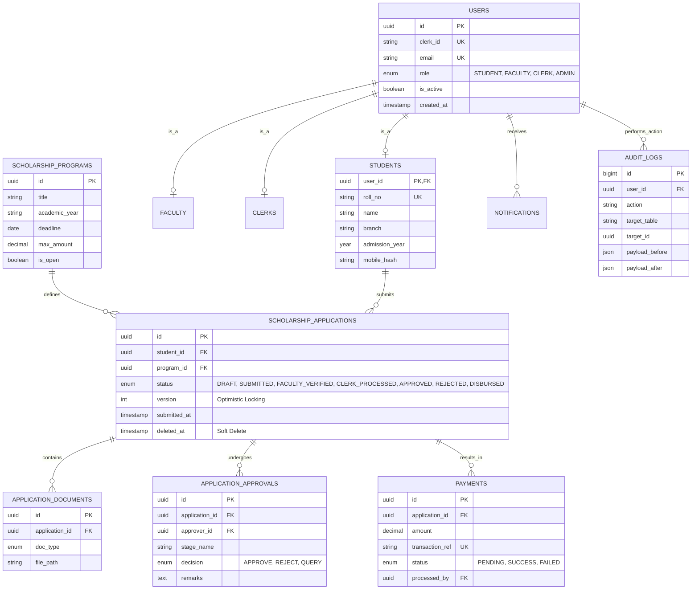

# Scholarship Management System - ER Diagram

```mermaid
erDiagram
    USERS ||--o| STUDENTS : "is_a"
    USERS ||--o| FACULTY : "is_a"
    USERS ||--o| CLERKS : "is_a"
    
    SCHOLARSHIP_PROGRAMS ||--o{ SCHOLARSHIP_APPLICATIONS : "defines"
    STUDENTS ||--o{ SCHOLARSHIP_APPLICATIONS : "submits"
    
    SCHOLARSHIP_APPLICATIONS ||--o{ APPLICATION_DOCUMENTS : "contains"
    SCHOLARSHIP_APPLICATIONS ||--o{ APPLICATION_APPROVALS : "undergoes"
    SCHOLARSHIP_APPLICATIONS ||--o{ PAYMENTS : "results_in"
    
    USERS ||--o{ NOTIFICATIONS : "receives"
    USERS ||--o{ AUDIT_LOGS : "performs_action"

    USERS {
        uuid id PK
        string clerk_id UK
        string email UK
        enum role "STUDENT, FACULTY, CLERK, ADMIN"
        boolean is_active
        timestamp created_at
    }

    STUDENTS {
        uuid user_id PK, FK
        string roll_no UK
        string name
        string branch
        year admission_year
        string mobile_hash
    }

    SCHOLARSHIP_PROGRAMS {
        uuid id PK
        string title
        string academic_year
        date deadline
        decimal max_amount
        boolean is_open
    }

    SCHOLARSHIP_APPLICATIONS {
        uuid id PK
        uuid student_id FK
        uuid program_id FK
        enum status "DRAFT, SUBMITTED, FACULTY_VERIFIED, CLERK_PROCESSED, APPROVED, REJECTED, DISBURSED"
        int version "Optimistic Locking"
        timestamp submitted_at
        timestamp deleted_at "Soft Delete"
    }

    APPLICATION_DOCUMENTS {
        uuid id PK
        uuid application_id FK
        enum doc_type
        string file_path
    }

    APPLICATION_APPROVALS {
        uuid id PK
        uuid application_id FK
        uuid approver_id FK
        string stage_name
        enum decision "APPROVE, REJECT, QUERY"
        text remarks
    }

    PAYMENTS {
        uuid id PK
        uuid application_id FK
        decimal amount
        string transaction_ref UK
        enum status "PENDING, SUCCESS, FAILED"
        uuid processed_by FK
    }

    AUDIT_LOGS {
        bigint id PK
        uuid user_id FK
        string action
        string target_table
        uuid target_id
        json payload_before
        json payload_after
    }
```
